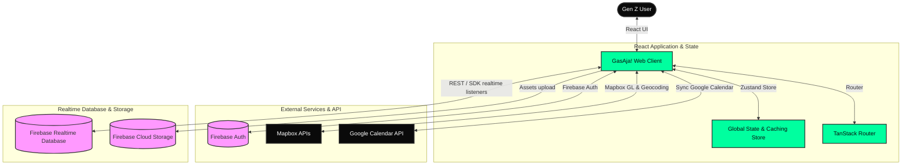

# System Architecture — GasAja!

GasAja! is built as a highly responsive, offline-capable, and real-time social planning application. This document details the system components, data flow, real-time sync mechanism, state management, and caching strategy.

---

## Architecture Diagram

The frontend application coordinates Firebase authentication, Mapbox geolocation APIs, and a state-synchronized client storage layer connected to the Firebase Realtime Database.

---

## 1. Authentication Flow

Authentication is managed via **Firebase Auth** with support for Email/Password and Google Sign-In:

1. **Sign-In Initiated**: User clicks "Continue with Google" or submits email auth.
2. **Provider Handshake**: Firebase Auth handles credentials and returns a token.
3. **Database Hook Sync**: The `useAuth` hook listens to state changes. On initial registration, it:
   - Allocates a custom username derived from email or display name.
   - Creates a profile mapping under `users/{uid}` in the Realtime Database.
   - Registers a lookup pair under `usernames/{username}` to support clean profile URLs (`gasaja.com/budi`).
4. **State Storage**: The active session is committed to `useAuthStore` to unlock protected routes instantly.

---

## 2. Real-Time Synchronization & Caching

GasAja! employs a hybrid REST and SDK approach to ensure peak responsiveness:

- **Cached Render (Instant UI)**: On mount, the Home Feed immediately renders posts and plans from local cache (`useCacheStore`), eliminating blank screens.
- **REST Sync (Parallel Fetch)**: A fast HTTP request pulls the latest global state from `/plans.json` and `/posts.json` and updates the state.
- **SDK Listeners (Live Updates)**: Active Firebase SDK `onValue` listeners are attached to keys (`plans`, `posts`, `stories`) to stream instant social interactions (likes, comments, participant additions) as they happen.

---

## 3. The Recommendation Algorithm ("For You" Feed)

Our Gen Z discovery feed runs a fast, front-end scored recommendation engine:

$$\text{Score} = (\text{Engagement} \times 0.40) + (\text{Recency} \times 0.35) + (\text{Media Bonus} \times 0.15) + (\text{Randomness} \times 0.10)$$

- **Engagement**: Calculated as a function of likes, comments count, and active attendees.
- **Recency**: Linear decay over 24 hours.
- **Media Bonus**: Boost for items containing cover images.
- **Randomness**: A deterministic session hash that introduces discovery variety while preventing list jumps on quick refreshes.
- **Interleaving**: The feed automatically alternates between Plans and Posts to prevent layout fatigue.
